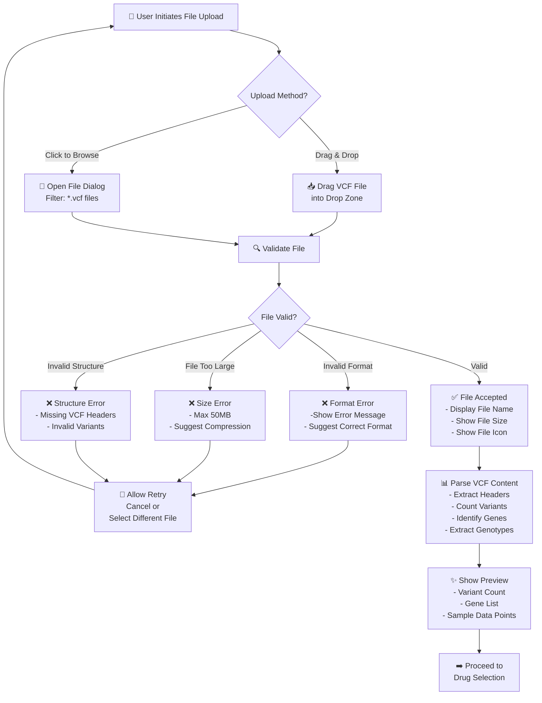
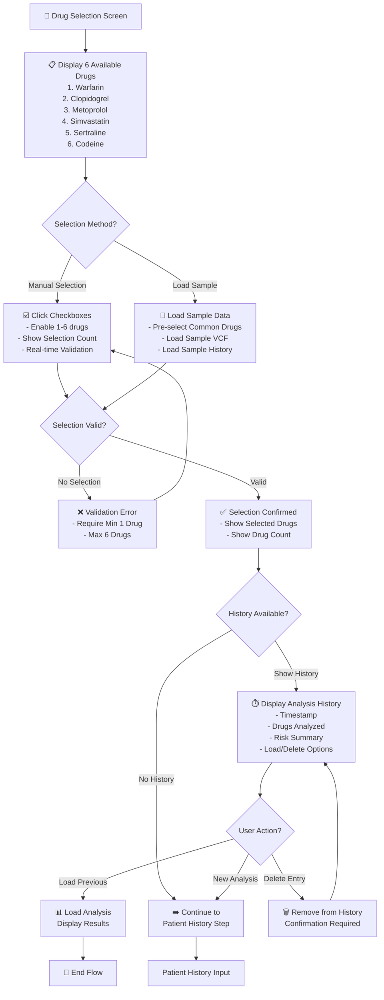
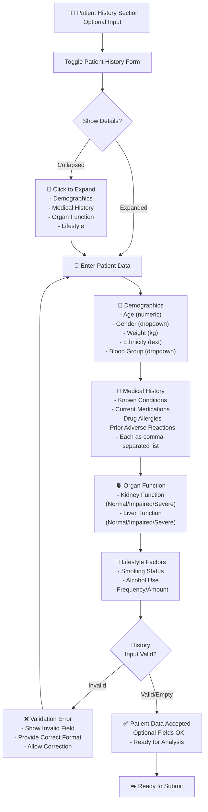
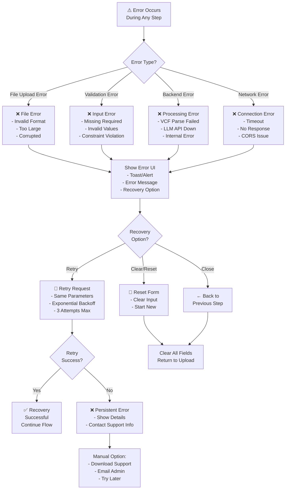
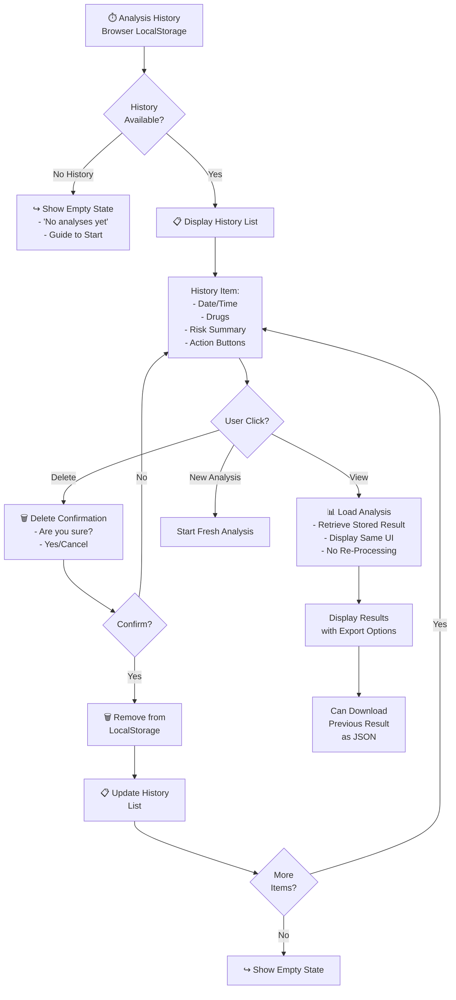
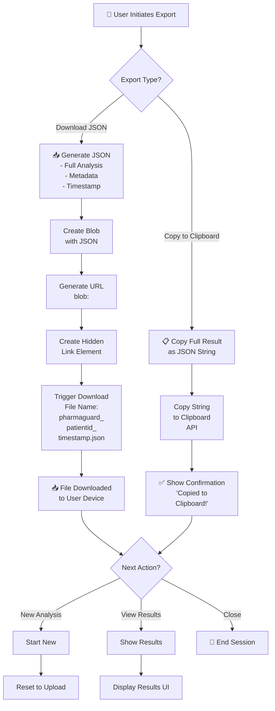
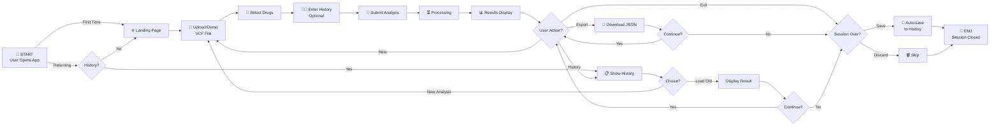

# User Flow Diagram - PharmaGuard

This document contains the user flow diagrams in Mermaid format for the PharmaGuard Pharmacogenomic Risk Prediction System.

## 1. Main User Flow Diagram

```mermaid
graph TD
    A[="👤 User Visits PharmaGuard"=] --> B{Load Type?}
    B -->|First Visit| C["🏠 View Landing Page<br/>- Title & Description<br/>- Quick Start Guide<br/>- Sample Data Option"]
    B -->|Returning User| D{History Available?}
    D -->|Show History| E["📋 Display Previous<br/>Analyses"]
    D -->|No History| C
    E -->|View Previous Result| F["📊 Display Analysis<br/>Results"]
    E -->|New Analysis| C

    C -->|Click Demo| G["📥 Load Sample Data<br/>- VCF File Loaded<br/>- Sample Drugs Selected"]
    C -->|Upload File| H["📁 Upload VCF File<br/>- Drag & Drop<br/>- File Selector"]

    G --> I["💊 Select Drugs<br/>1-6 from List:<br/>- Warfarin<br/>- Clopidogrel<br/>- Metoprolol<br/>- Simvastatin<br/>- Sertraline<br/>- Codeine"]
    H --> I

    I --> J{Include Patient<br/>History?}
    J -->|Yes| K["👨‍⚕️ Enter Patient History<br/>- Demographics<br/>- Medical History<br/>- Organ Function<br/>- Lifestyle Factors"]
    J -->|No| L["✅ Ready to Analyze"]
    K --> L

    L --> M{Selected?}
    M -->|Validate| N{Valid Input?}
    N -->|Invalid| O["❌ Error Notification<br/>- Show Error Message<br/>- Highlight Issues"]
    O --> L
    N -->|Valid| P["🔄 Send to Backend<br/>POST /api/analyze<br/>- VCF File<br/>- Drug List<br/>- Patient History"]

    P --> Q["⏳ Show Loading State<br/>- Spinner Animation<br/>- Processing Message<br/>- Cancel Status"]

    Q --> R["🧬 Backend Processing<br/>- Parse VCF<br/>- Identify Genes<br/>- Calculate Phenotypes<br/>- Apply Clinical Modifiers<br/>- Check Interactions<br/>- Score Evidence<br/>- Generate LLM Text"]

    R --> S{Processing<br/>Success?}
    S -->|Failed| T["⚠️ Error Handling<br/>- Display Error Message<br/>- Offer Retry<br/>- Clear/Reset Option"]
    T --> C
    S -->|Success| U["📊 Display Results<br/>Complete Analysis"]

    U --> V["🎯 Show Summary Dashboard<br/>- Risk Level (Color)<br/>- Metabolizer Status<br/>- Gene Count<br/>- Drug Count<br/>- Alert Count"]

    V --> W["🧬 Show Gene Panel<br/>Gene Cards with:<br/>- Gene Name<br/>- Star Alleles<br/>- Phenotype Badge<br/>- Function Description"]

    W --> X["💊 Show Drug Risk Table<br/>Columns:<br/>- Drug Name<br/>- Risk Label<br/>- Risk Percentage<br/>- Severity<br/>- Details Button"]

    X --> Y["📝 Show Detailed Reports<br/>For Each Drug:<br/>- Patient Info<br/>- Clinical Modifiers<br/>- Variants Table<br/>- Interactions<br/>- Evidence Score<br/>- Recommendations<br/>- AI Explanation"]

    Y --> Z{User Action?}
    Z -->|Download JSON| AA["💾 Export Analysis<br/>- Generate JSON<br/>- Trigger Download<br/>- Timestamp Included"]
    Z -->|Copy to Clipboard| AB["📋 Copy to Clipboard<br/>- JSON Copied<br/>- Show Confirmation"]
    Z -->|New Analysis| C
    Z -->|View History| E
    Z -->|Scroll| Y

    AA --> AC{Continue?}
    AB --> AC
    AC -->|New Analysis| C
    AC -->|Exit| AD["👋 Session Ends<br/>Results Saved to<br/>Browser History"]
```

## 2. File Upload & Validation Flow



## 3. Drug Selection & History Flow



## 4. Patient History Input Flow



## 5. Analysis Processing Flow

```mermaid
graph TD
    A["🚀 User Clicks Analyze<br/>Submit Button"] --> B["📤 Prepare Request<br/>POST /api/analyze"]

    B --> C["📦 Package Data<br/>- VCF File<br/>- Selected Drugs<br/>- Patient History<br/>- Session ID"]

    C --> D["⏳ Show Loading State<br/>- Display Spinner<br/>- 'Analyzing...' Message<br/>- Disable Further Input"]

    D --> E["🔄 Backend Processing<br/>START"]

    E --> F["📖 Parse VCF File<br/>- Extract Variants<br/>- Validate Format<br/>- Build Genetic Profile"]

    F --> G["🧬 Identify Genes"]
    G --> H["Process Each Drug"]

    H --> I["🔍 Gene Mapping<br/>- Find Relevant Gene<br/>- Get Baseline Metabolizer<br/>- Check Star Alleles"]

    I --> J["📊 Risk Assessment<br/>- Analyze Variants<br/>- Determine Phenotype<br/>- Calculate Risk %" ]

    J --> K["🏥 Apply Clinical<br/>Modifiers<br/>- Adjust for Patient<br/>History<br/>- Kidney/Liver Status<br/>- Other Drugs"]

    K --> L["💊 Check Drug<br/>Interactions<br/>- Cross-drug<br/>- Drug-History"]

    L --> M["📈 Score Evidence<br/>- Variant Quality<br/>- Annotation Confidence<br/>- Clinical Significance"]

    M --> N["🤖 Generate LLM<br/>Explanation<br/>- Call Google Gemini<br/>- Natural Language<br/>- Clinical Context"]

    N --> O["📋 Build Clinical<br/>Recommendations<br/>- Dosing Guidance<br/>- Monitoring Needs<br/>- Alternatives"]

    O --> P["✅ Create Result<br/>Package"]

    P --> Q["📤 Return to Frontend<br/>PharmaGuardResult[]"]

    Q --> R{Response<br/>Success?}
    R -->|Failed| S["❌ Error Handling<br/>- Log Error<br/>- Return Error Message<br/>- Suggest Retry"]
    S --> T["Show Error to User"]
    R -->|Success| U["📊 Receive Results<br/>Hide Loading<br/>Display Analysis"]

    U --> V["Display Results UI"]
```



## 6. Results Display & Interaction Flow

```mermaid
graph TD
    A["📊 Analysis Complete<br/>Results Received"] --> B["Hide Loading State<br/>Display Results Container"]

    B --> C["🎯 Summary Dashboard<br/>Quick Metrics Widget"]
    C --> D["Risk Level Card<br/>- Color Coded<br/>- Percentage<br/>- Severity"]

    D --> E["Gene Count Badge<br/>- Number of Genes<br/>- Icon"]

    E --> F["Drug Count Badge<br/>- Number of Drugs<br/>- Icon"]

    F --> G["Alert Count Badge<br/>- Critical Alerts<br/>- Warning Count"]

    G --> H{User Scrolls/<br/>Clicks?}
    H -->|Scroll Down| I["🧬 Gene Panel<br/>Gene Cards Section"]

    I --> J["Card for Each Gene<br/>- Gene Name<br/>- Star Alleles<br/>- Phenotype Badge<br/>- Function Info"]

    J --> K{Continue?}
    K -->|Scroll| L["💊 Drug Risk Table<br/>Summary Table"]

    L --> M["Table Rows:<br/>Drug | Risk | % | Severity"]

    M --> N["Row Click/Expand"]

    N --> O["📖 Detailed Report<br/>for Selected Drug"]

    O --> P["Patient Info Grid<br/>Demographics<br/>Clinical Data"]

    P --> Q["🔬 Detected Variants<br/>Table with:<br/>RSID, Genotype,<br/>Zygosity, Star Alleles"]

    Q --> R["💊 Drug Interactions<br/>List:<br/>- Drug Name<br/>- Severity<br/>- Mechanism"]

    R --> S["📈 Evidence Score<br/>Progress Bar<br/>Confidence Factors"]

    S --> T["💡 Clinical<br/>Recommendations<br/>- Dosing<br/>- Monitoring<br/>- Alternatives"]

    T --> U["🤖 AI Explanation<br/>Natural Language<br/>from Gemini"]

    U --> V{User Action?}
    V -->|Scroll Back| L
    V -->|Different Drug| O
    V -->|Export/Download| W["💾 Export Options"]
    V -->|New Analysis| X["Start Over"]

    W --> Y["Choose Format<br/>Download JSON<br/>Copy to Clipboard"]

    Y --> Z["Generate Export<br/>Timestamp<br/>Complete Profile"]

    Z --> AA["Trigger Download<br/>or Copy Confirm"]

    AA --> AB{"Further<br/>Action?"}
    AB -->|Yes| L
    AB -->|No| AC["👋 End Session<br/>Auto-save to History"]
```



## 7. Error Handling & Recovery Flow



## 8. History Management Flow



## 9. Export & Download Flow



## 10. Session Flow - Complete Journey



---

## Diagram Legend

| Symbol | Meaning            |
| ------ | ------------------ |
| 🔵     | Start Node         |
| 🔴     | End Node           |
| ➡️     | Process Flow       |
| ❌     | Error State        |
| ✅     | Success State      |
| ⏳     | Loading/Processing |
| 💾     | Storage/Save       |
| 📊     | Display/Report     |
| 💊     | Drug Related       |
| 🧬     | Genetic Data       |
| 👨‍⚕️     | Patient/Clinical   |
| 🤖     | AI/LLM             |
| 🔄     | Retry/Repeat       |

---

## User Journey Summary

1. **Landing** → User visits app
2. **Upload** → Select VCF file (manual or demo)
3. **Selection** → Choose 1-6 drugs
4. **History** → Optional patient info
5. **Analysis** → Backend processes request
6. **Results** → View comprehensive reports
7. **Export** → Download JSON or copy
8. **History** → Auto-saved for future reference

---

_This user flow diagram provides a complete visualization of user interactions with the PharmaGuard system, from initial landing through result export and session management._
